

     
     
     
    
        
<b>总体设计报告</b>

    
     
     
     
	
    	
<b>SimulSpeak同声传译视频平台</b>

    	 
         
         
         
        
邱日宏 (3200105842)

         
        
潘嘉葆 (3200102835)

         
        
刘志坚 (3200105516)

         
        
马逸伦 (3200100673)

         
	

# 总体设计报告

## 引言

### 编写目的

总体设计报告（System Design Document）是在软件或系统开发的早期阶段，通过对项目需求、系统设计目标、架构设计、模块设计、接口设计、数据库设计、安全设计、性能设计、测试设计、部署和维护设计、风险评估和项目管理等方面进行详细描述和分析的一份重要文档。

总体设计报告的主要目的是为软件或系统开发的整个周期提供指导，确保开发团队在软件或系统设计阶段充分考虑各方面的因素，以便在后续的开发和实施中达到预期的目标。

在这份总体设计报告中，我们将阐述设计方案的基本框架，从而让开发团队、测试团队和其他利益相关者了解系统设计的方向，以及为设计过程中可能出现的问题提供解决方案。总体设计报告还应该包含每个模块的详细设计，并定义开发人员将使用的编码规范、接口协议等。

同时，我们的报告也是为了与客户、项目管理层、测试团队等交流和沟通。通过总体设计报告，这些利益相关者可以了解项目的开发方向、需求和设计要求，同时也可以为项目提出宝贵的建议和反馈。

### 项目背景

随着全球化和跨文化交流的加强，这种应用可以帮助人们在跨语言沟通中消除障碍，扩大用户群体。同时，这种应用也能够为旅游、商务、教育等领域提供更多的可能性。然而，市场竞争激烈，需要不断创新以满足用户需求，并且技术上存在挑战，如语音识别和翻译质量等问题需要解决。

项目目标为开发一个同声传译的视频平台SimulSpeak，其可以完成上传并播放视频、对视频进行同声传译和字幕翻译等功能。虽然目前短视频平台蓬勃发展，但是其大多只是用于某个国家或地区的学习或生活分享，并且对于不同语言的短视频缺少翻译功能。

鉴此，我们目标搭建一个跨越语言壁垒的短视频平台，把不同国家的教学资源、日常分享等的视频汇总，并通过同声传译和字幕翻译来打破语言壁垒，共享多个国家的资源。

同时，通过这个平台，既可以让想要学习某种知识的人群在其中准确找到自己的目标视频，而不是在各个平台或者网页进行检索，减少花费在总结与查找的时间，进而提升学习的效率也可以让某一国家的人群了解其他国家人民的生活状态，实现全球性的信息共享。

## 体系结构设计

### 设计目的

在软件开发领域中，需求分析和体系结构设计就如同春雨润物一般，为软件开发的后续步骤奠定了坚实的基础。而在这些基础中，体系结构设计则扮演着举足轻重的角色。

体系结构设计是软件开发过程中的重要环节，它涉及到系统的总体结构、各个模块之间的关系和系统的组成部分等方面。在需求分析的基础上，体系结构设计需要充分考虑到软件系统的性能、可扩展性、可维护性和安全性等方面的问题，以确保软件系统的稳定性和高效性。

在进行体系结构设计时，需要根据需求分析结果，结合软件开发的实际情况，确定系统的总体结构和各个模块之间的关系，以及系统的组成部分和各个部分之间的关系。同时，还需要考虑到系统的性能、可扩展性、可维护性和安全性等方面的问题，以保证系统的可靠性和高效性。

体系结构设计的核心在于模块化设计，即将系统分成若干个模块，每个模块具有独立的功能，且模块之间的耦合度要尽量降低。在进行模块化设计时，需要根据系统的功能和需求进行划分，同时还需要考虑到模块之间的接口设计，以保证模块之间的数据传输和信息交互的准确性和高效性。

此外，在体系结构设计中，还需要考虑到系统的性能优化和可扩展性问题。为了提高系统的性能和可扩展性，需要选择合适的技术方案和架构模式，并且要对系统进行适当的优化和调整，以保证系统的高效性和可扩展性。

综上所述，体系结构设计是软件开发中不可或缺的一环，它的重要性不言而喻。只有在进行了充分的需求分析和体系结构设计之后，才能为软件开发的后续步骤打下坚实的基础，以确保软件系统的稳定性和高效性。

### 体系结构风格

体系结构风格是指体系结构中用于描述和组织系统各个组件的基本结构和形式。它是一种通用的设计模式，可用于解决特定的问题或满足特定的需求。不同的体系结构风格具有不同的特点和适用范围，选择适合的体系结构风格对于软件系统的可靠性和可扩展性至关重要。

以下是几种常见的体系结构风格：

1. 客户端-服务器体系结构风格（Client-Server Architecture Style）： 客户端-服务器体系结构是最常用的体系结构风格之一，它将系统分成两个主要部分：客户端和服务器。客户端向服务器请求服务，并将结果返回给用户。这种体系结构风格的主要优点是可扩展性和可维护性高，同时还能够提高系统的安全性和可靠性。
2. 分层体系结构风格（Layered Architecture Style）： 分层体系结构风格是一种将系统分成多个层次的体系结构，每一层都有特定的功能和责任。这种体系结构风格的主要优点是模块化程度高，易于维护和升级，同时还能够提高系统的性能和可扩展性。
3. 事件驱动体系结构风格（Event-Driven Architecture Style）： 事件驱动体系结构风格是一种通过事件来驱动系统中各个模块的交互的体系结构，它通过事件的触发来实现各个模块之间的信息交换和数据传输。这种体系结构风格的主要优点是响应速度快，具有高度的灵活性和可扩展性，同时还能够提高系统的可靠性和可维护性。
4. 微服务体系结构风格（Microservices Architecture Style）： 微服务体系结构是一种将系统分解为多个独立的服务的体系结构，每个服务都有自己独立的开发、测试和部署流程。这种体系结构风格的主要优点是具有高度的可扩展性和灵活性，同时还能够提高系统的可维护性和可靠性。

总之，不同的体系结构风格都有各自的特点和适用范围，选择适合的体系结构风格对于软件系统的开发和维护都非常重要。

## 层级结构

在我们所设计的SimulSpeak同声传译视频平台中，我们采用了前后端分离的架构，分别开发前端的手机移动端应用和后端的服务器架构。
在前端设计中，前端应用主要负责和后端服务器进行通信，通过向服务器发送请求和接收服务器给出的响应来实现视频渲染、用户管理、视频上传等功能。
在后端架构中，我们采用了中间件加微服务的架构，搭建起整个后端的框架。
在后端的服务器之中，我们有一个用于接收客户端所发送的请求和向客户端提供应答的消息转发处理中间件。根据请求的复杂程度，服务器的响应策略也不尽相同。如果对应的请求响应服务比较简单，那么我们直接在服务器中通过设计子模块的方式完成想相应请求的处理和回应；如果对应的请求是诸如同声传译、视频上传或接收等这样较为复杂的请求，我们的服务器则是通过网络通信模块将相应的请求转发给对应提供服务的微服务模块，让微服务模块实现所需要的完整功能，并将处理后的结果传回服务器或直接转发给客服端。

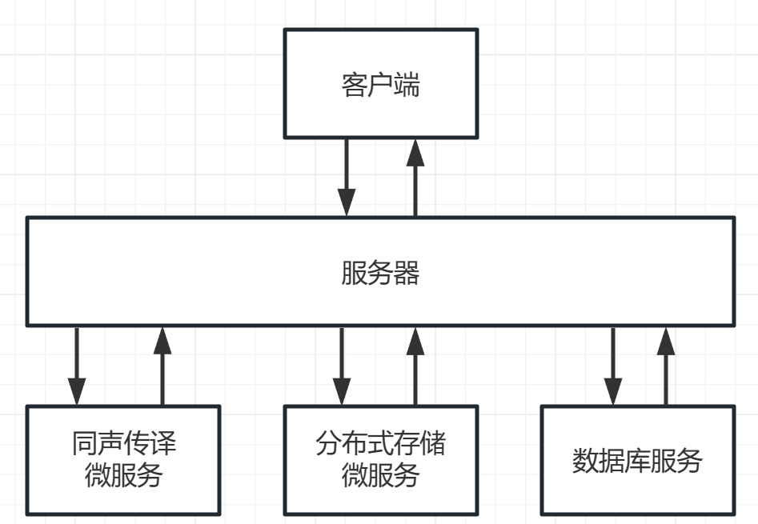

### 顶层-客户端子系统（Client）

需要实现和服务器系统以及存储系统的通信，因此客户端子系统也拥有着网络模块、解码模块，此外在需求中提到的优美的 UI设计对于视频平台是非常重要的，因此也需要用户界面模块，当然还包括用户行为的逻辑分析。因此客户端子系统包括以下子模块：

* 网络模块：主要负责客户端系统与服务端和存储端的通信 
* 解码模块：主要负责解析数据并充分展示 
* 用户界面模块：充分的界面展示，用户行为的逻辑分

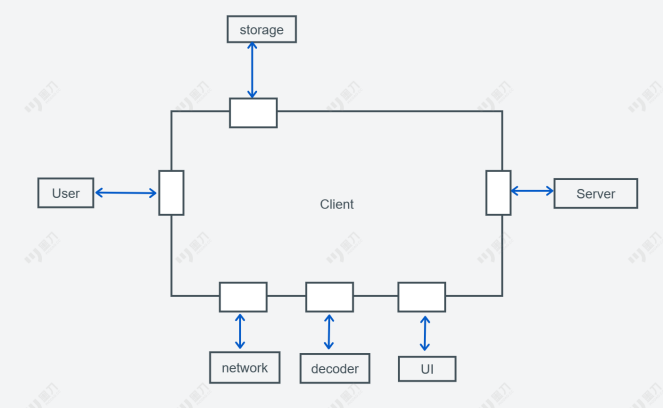

完成次顶层的环境搭建之后，我们需要完成更细致的中间层的功能模块的环境和原型设计

### 中间层-客户端子系统的网络模块（Network）

该系统需要负责与服务器端和存储端分别进行通信，其中和服务器端通信获取控制信息，和存储端通信获取数据信息，并负责收到数据的解码。

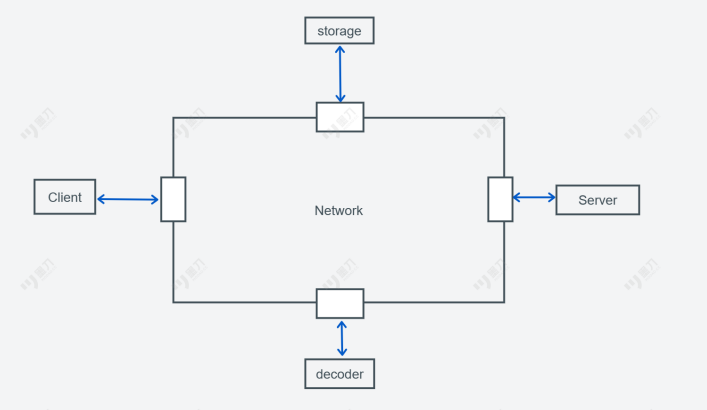

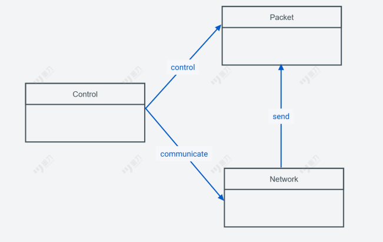

### 中间层-客户端子系统的解码模块

此部分负责网络传输后的解码，由于我们采用类传输，因此该模块较为简单。

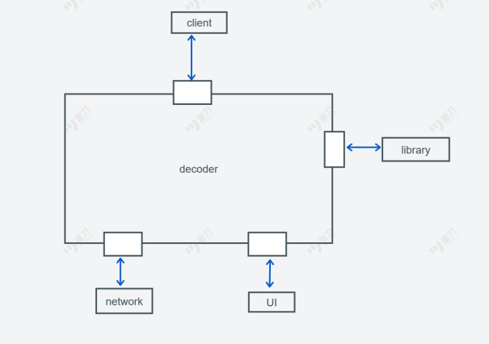

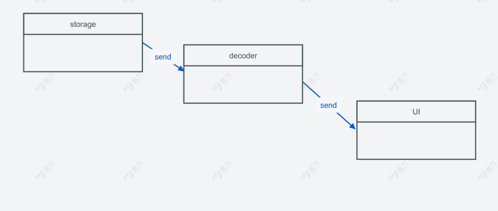

### 中间层-客户端子系统的用户界面模块（UI）

此模块使用到的底层模块是特定的 GUI 库。这是和用户、客户端交互的模块， 因此需要根据用户需求进行测试和维护，达到引人注目的效果。

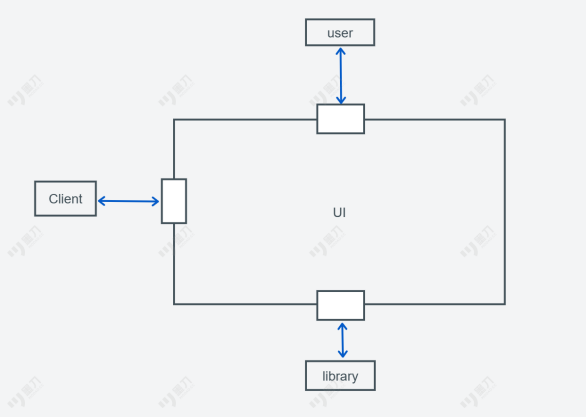

我们使用MVC模式来进行UI的总体设计。

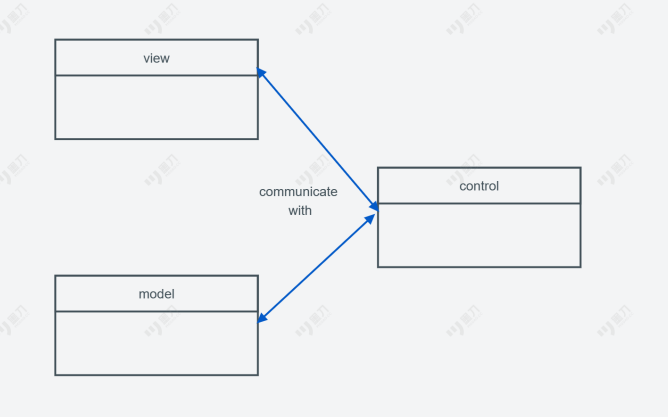

### 顶层-服务器子系统（Server）

服务器模块主要作为消息处理和转发的模块，负责将来自客户端的各类请求，并将这些请求转发给合适的服务进行处理。

服务器模块的详细设计图如下：

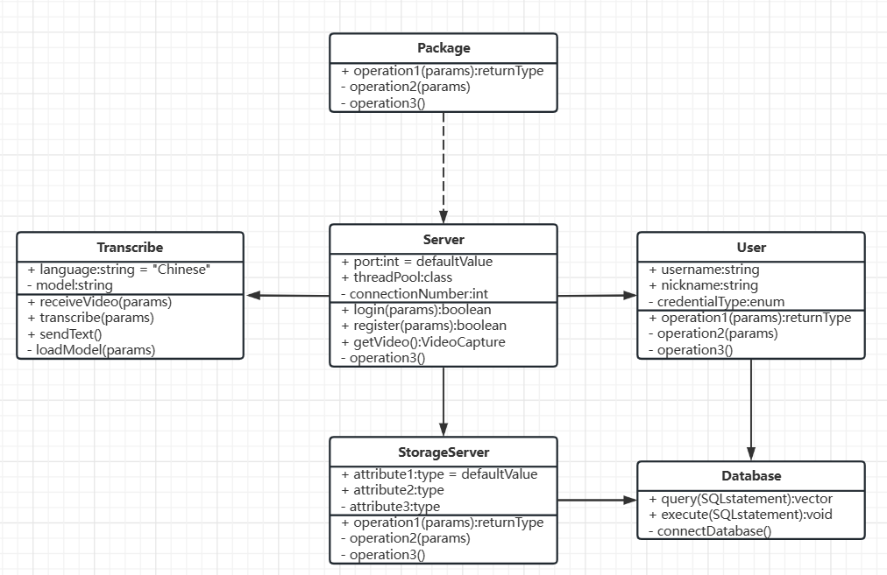

### 微服务-同声传译系统

SimulSpeak的同声传译系统部分主要采用了OpenAI所提供的Whisper预训练模型来提供对视频中的语音识别与

### 顶层-分布式存储系统（Storage）

本部分叙述后台分布式存储的构架设计。

可以将服务器分成一下两类：跟踪服务器(Tracker Server)和存储服务器(Storage Server)。

### 次顶层-跟踪服务器

跟踪服务器是一种辅助服务器，用于记录和存储用户的请求信息和视频传输状态。该服务器可以实时监测整个视频传输过程中的数据流向和传输时间，以及处理和存储服务器的状态。通过跟踪服务器，我们可以更快地定位和解决系统中可能存在的问题和故障，并更加有效地把握系统的运行情况。此外，跟踪服务器还能提供一些统计信息和数据分析报告，帮助管理者更好地了解用户的需求和系统的运行情况。

### 次顶层-存储服务器

存储服务器是系统中非常重要的组成部分，用于存储和维护所有上传的视频数据。通过对存储服务器进行规划和分配，我们可以将不同类型的视频数据分别存储在不同的存储服务器上。同时，存储服务器还需要支持高效的数据读取和传输，确保用户可以快速地访问和观看自己想要的视频内容。为了提升数据存储效率和可靠性，我们还可以在存储服务器上部署一些数据备份和恢复机制，确保视频数据的安全和可靠性。

## 服务器设计

根据服务器的种类区分，跟踪服务器和存储服务器所执行的工作并不是相同的。其中客户端请求的初步处理需要连接跟踪服务器，而实际的获取需要连接存储服务器。其中整体的流程如下。

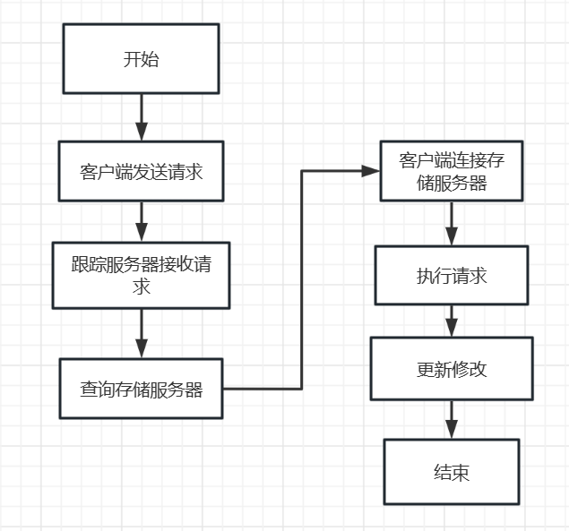

其中客户端的主要操作分为上传视频和申请视频两种操作，这两种操作跟踪服务器和存储服务器的操作是不相同。

### 申请视频

跟踪服务器收到请求后，从连接的数据库中查询并获得存储该视频文件的存储服务器的ip地址和端口号，并将这些信息发送给客户端。

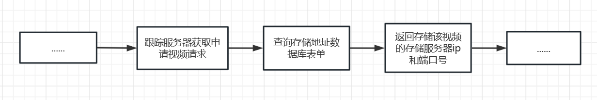

客户端收到存储服务器的ip地址和端口号之后，通过网络协议与存储服务器建立连接，然后向存储服务器发送读取视频数据的请求。存储服务器接收到客户端的请求后，从磁盘中读取视频文件的数据，并将数据通过网络协议传输给客户端。发送记录到跟踪服务期。

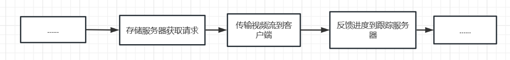

### 上传视频

跟踪服务器收到请求后，从连接的数据库中查询各个存储服务器存储状态，根据一定策略，比如存储量最少，结合当前负载，选择一个存储服务器，并将他的ip和端口号这发送给客户端。

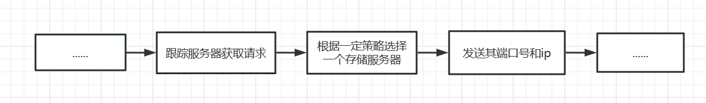

客户端向存储服务器发送存储视频数据的请求。存储服务器接收到客户端的请求后，接收客户端传来的数据。完成后将相应的修改反馈给跟踪服务器

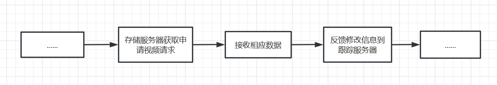

### 数据库设计

#### 用户管理

在用户权限管理设计部分，我们主要需要实现如下功能：

* 用户登录
  * 账号-密码登录
  * 手机号-验证码登录
  * （待扩展）
* 用户权限管理
  * 管理员
  * 普通用户

对于用户管理来说，一个核心是记录用户的基础信息，另一个核心则是管理用户的登录信息。

无论是使用账号-密码登录，还是手机号-验证码登录，亦或是其他登录方式，对于用户的各类登入模式来说，其都可以抽象为（用户信息，密码）的验证形式。

因此，为了方便我们对用户登录方式进行扩展，我们将用户管理部分的用户信息分为`用户基础信息表`和`用户授权信息表`两张表来分别存储。

**用户基础信息表**

【描述】

用户基础信息表用户存储用户前端显示的基本信息，便于前端根据用户基础信息表展现用户信息

【设计】

Table: **user_info**

Description: use information

| Field    | Type        | Null | Key  | Default | Extra          |
| -------- | ----------- | ---- | ---- | ------- | -------------- |
| user_id  | int         | no   | PRI  | NULL    | auto_increment |
| username | varchar(40) | no   |      | NULL    | unique         |

**用户授权信息表**

【描述】

用户基础信息表用户存储用户前端显示的基本信息，便于前端根据用户基础信息表展现用户信息

【设计】

Table: **user_auth**

Description: use authentications

| Field         | Type         | Null     | comment                                    |
| ------------- | ------------ | -------- | ------------------------------------------ |
| auth_id       | int          | NOT NULL | id, AUTO_INCREMENT, 主键                   |
| user_id       | int          |          | 用户id, (参照 user_info 表的 user_id 字段) |
| identity_type | varchar(32)  | NOT NULL | 认证类型                                   |
| identifier    | varchar(255) | NOT NULL | 用户标识                                   |
| credential    | varchar(255) | NOT NULL | 凭证                                       |

#### 视频管理

设计如下的数据库表单，用来辅助申请视频和上传视频这两个功能：

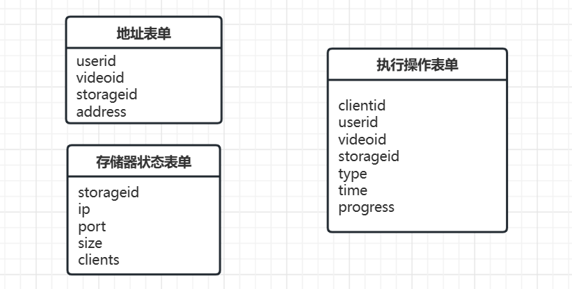

## UI 设计

### 设计原则

视频APP的UI界面设计需要遵循以下原则：

1. 简洁明了：视频APP的UI界面应该简洁明了，方便用户快速找到自己想要的内容和功能。过于复杂和繁琐的界面可能会让用户感到不适。
2. 直观易用：用户在使用视频APP时，希望能够直观地了解APP的使用方法，从而更好地完成操作。因此，视频APP的UI界面应该尽可能地易于使用和理解。
3. 色彩搭配合理：色彩搭配是视频APP UI设计中非常重要的一环。良好的色彩搭配可以营造出舒适、愉悦的用户体验，提高用户留存率。
4. 多样化风格：不同的用户群体喜欢的风格各异，因此，视频APP的UI界面设计应该多样化，包括但不限于颜色、图片、字体等方面。
5. 反馈及时：在用户使用过程中，需要及时给予反馈，例如提示、动画等形式，让用户知道自己的操作是否成功，以提升用户体验。
6. 交互性强：视频APP需要大量的交互操作，如播放、暂停、上下滑动等，因此，UI设计需要充分考虑交互性，使用户操作更加自然、流畅，提高APP的可用性。
7. 可定制性强：用户可能有不同的偏好，因此，视频APP的UI设计应该具备一定程度的可定制性，例如换肤、设置等功能，帮助用户更好地个性化使用APP。

### UI原型设计

#### 登录页面

###### 登录页面功能

- 位于app的启动页之后，第一个出现的页面。
- 包含用户登录所需的表单项和按钮。

**UI元素：**

1. App logo
2. 标题（例如：欢迎来到App名）
3. 用户名输入框
4. 密码输入框
5. 登录按钮
6. 注册新账户链接

**设计要点：**

- App logo应该清晰、易于识别，且与品牌一致。
- 标题应该简短、明确，吸引用户的注意力。
- 用户名和密码输入框应该清晰地标注其用途，例如使用占位符或标签。
- 忘记密码链接应该明显的显示在密码输入框下方，以便于用户找到并进行重置。
- 登录按钮应该明显且易于点击，以便于用户进行登录。
- 注册新账户链接应该在登录按钮下方明显展示，并提供简单的注册流程。

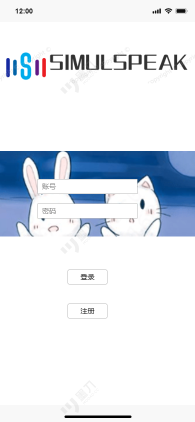

#### 播放界面

1. **视频播放器**

首先，我们需要提供一个视频播放器，用于播放视频。播放器应该包含视频控制条、播放/暂停按钮、音量控制、全屏切换等功能。

2. **视频信息**

其次，为了让用户更好地了解当前正在播放的视频，我们需要在界面上显示视频的标题、时长、作者、发布时间等信息。

3. **相关推荐**

除了当前正在播放的视频之外，我们也希望能够向用户推荐其他相关视频。因此，在视频播放界面上，我们可以加入一些相关视频的缩略图，供用户点击观看。                                                     

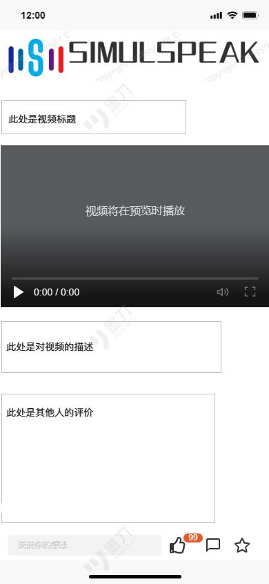

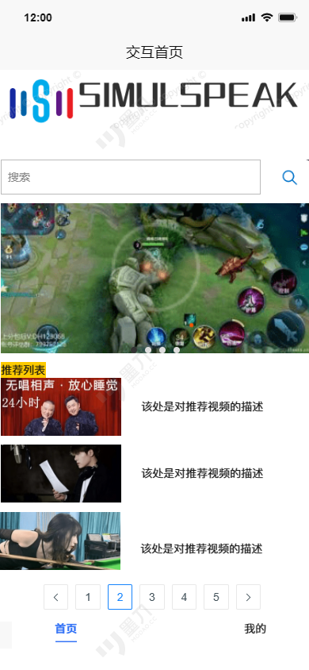

